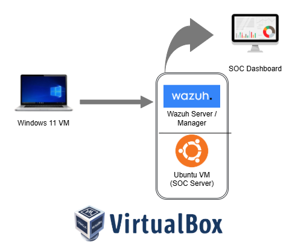
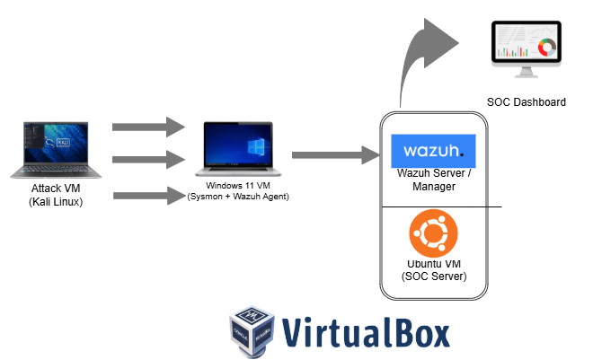

# SOC Lab Architecture Evolution

This folder documents the evolution of my SOC home lab architecture.

## Initial SOC Lab Architecture
This architecture represents the initial setup focused on log collection
and analysis using Windows endpoints and Wazuh SIEM.

## Detection & Threat Simulation Architecture
This updated architecture introduces an attack simulation VM (Kali Linux)
to generate adversary behavior for detection validation.

