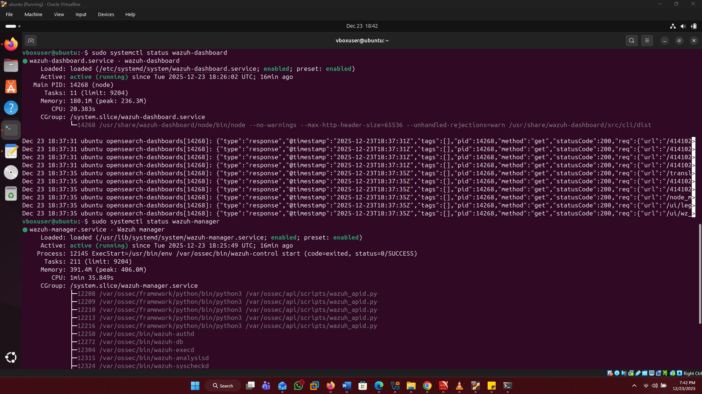
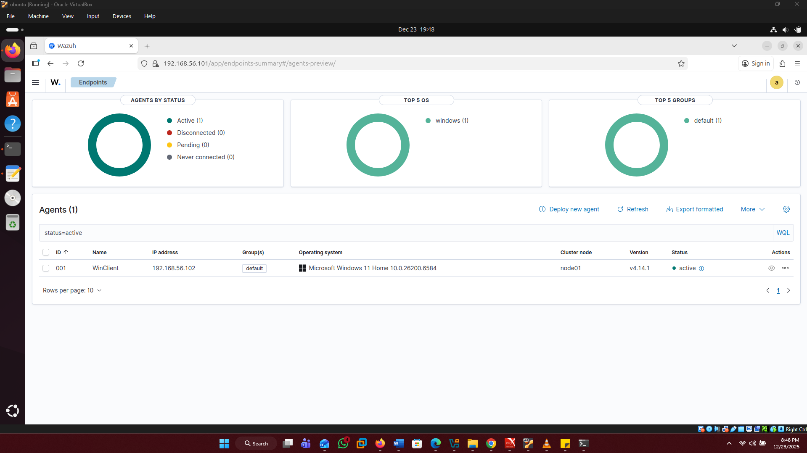
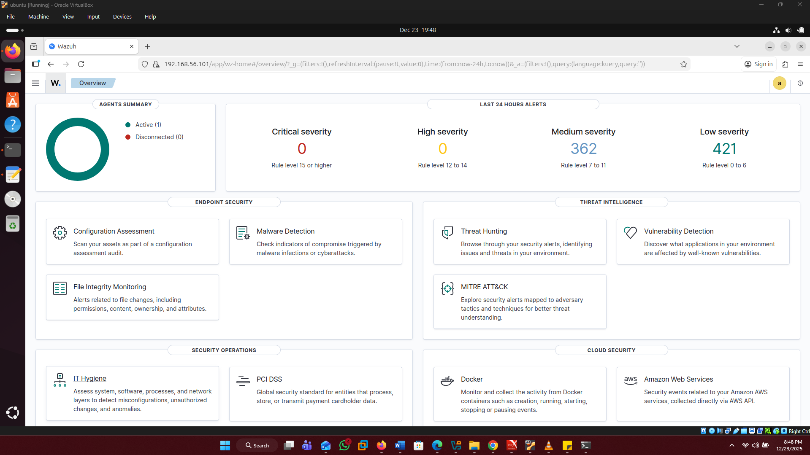

# SOC Lab Setup and Architecture

## Objective
To design and deploy a functional Security Operations Center (SOC) lab environment for hands-on security monitoring, detection, and investigation.

## Lab Environment
- Virtualization Platform: VirtualBox
- Windows 11 Virtual Machine (Endpoint)
- Ubuntu Linux Virtual Machine (Server)
- Wazuh SIEM (Manager & Dashboard)

## Architecture Overview
The lab consists of a Windows endpoint and a Linux server configured to forward logs to a centralized SIEM. The SIEM collects, analyzes, and generates alerts based on security events occurring within the environment.

## Setup Summary
- Installed virtualization software
- Created Windows 11 and Ubuntu virtual machines
- Installed and configured Wazuh Manager on Ubuntu
- Installed Wazuh agent on Windows endpoint
- Verified log ingestion and agent connectivity

 ## Implementation & Verification

### 1. Wazuh Service Status
Verified that the Wazuh Manager, Indexer, and Dashboard services are all active and running on the Ubuntu server.

### 2. Dashboard Access
Successfully accessed the Wazuh Web UI via the server's static IP address.

### 3. Pre-Deployment State
The dashboard view prior to agent installation, showing no active endpoints.

### 4. Agent Connectivity
Confirmed that the Windows 11 endpoint (WinClient) is successfully communicating with the manager and appearing as "Active."

### 5. Final Overview & Log Ingestion
The manager is now actively parsing security events and displaying telemetry on the main dashboard.

## Data Flow
1. Security events occur on the Windows endpoint
2. Logs are collected by the Wazuh agent
3. Events are forwarded to the Wazuh Manager
4. Alerts are generated and viewed on the Wazuh dashboard

## Documentation
This lab includes:
- Architecture diagram
- Setup notes and configuration highlights
- Verification screenshots showing agent connectivity and log ingestion

## Outcome
A fully functional SOC lab environment capable of supporting log analysis, alert investigation, and attack simulation in subsequent labs.

## Next Steps
- Enable advanced Windows logging (Sysmon)
- Begin Windows Event Log analysis
- Simulate security events for detection practice
