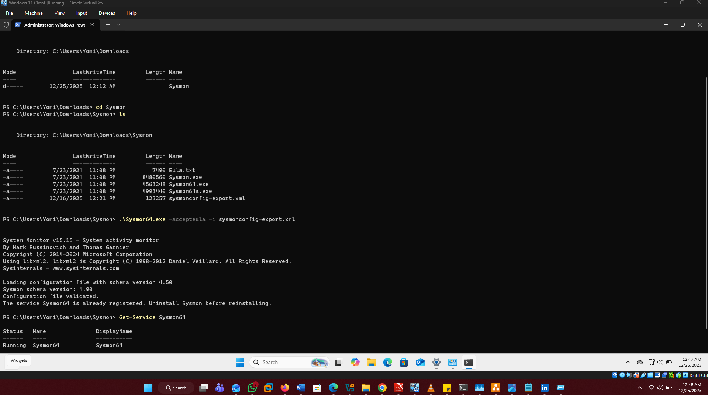
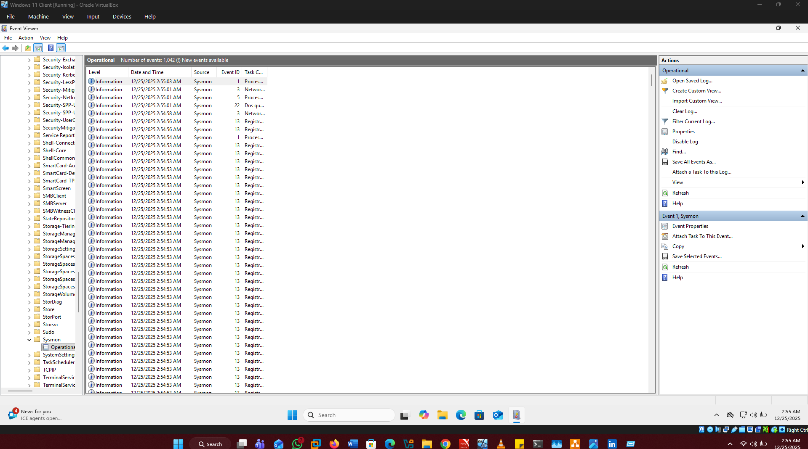
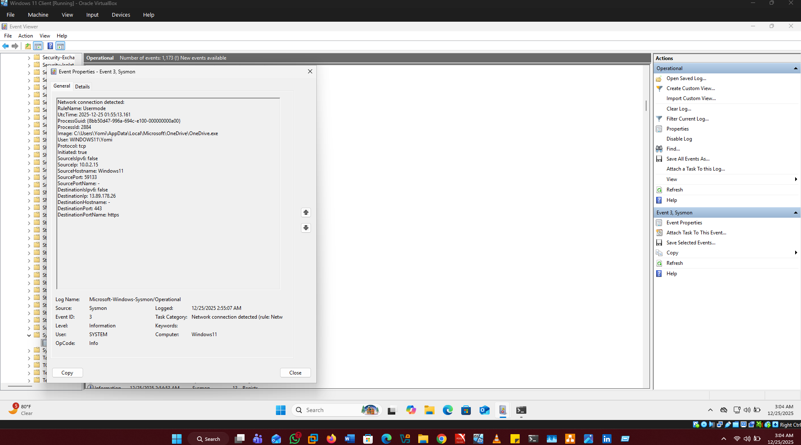
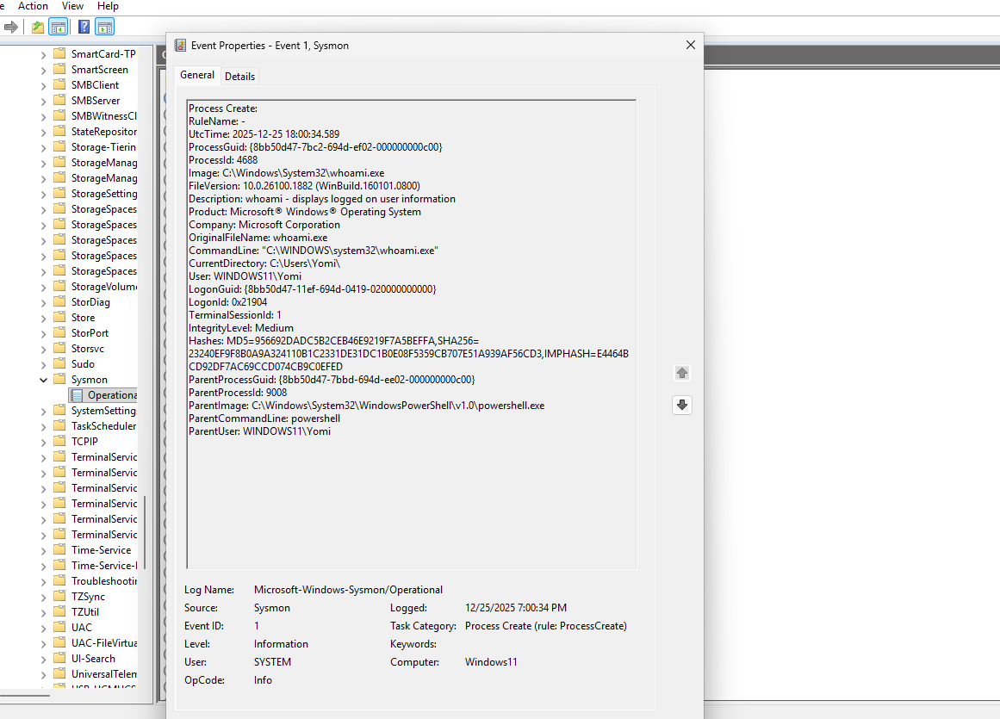
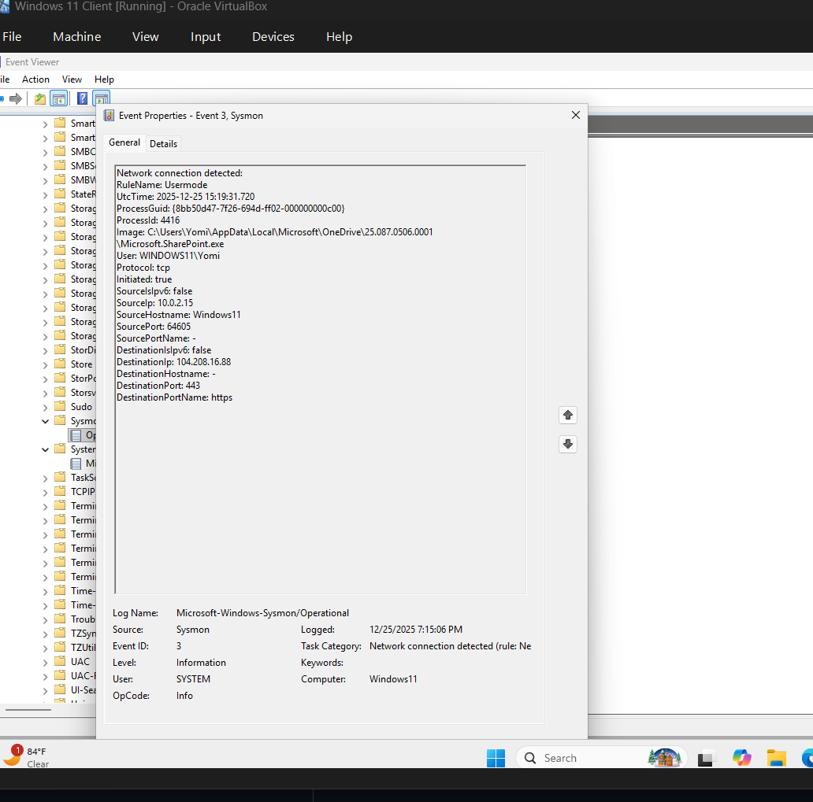

# Sysmon Installation and Log Review

## Objective
Enhance Windows log visibility by installing Sysmon and analyzing detailed
process and network activity relevant to SOC investigations.

## Activities Performed
- Installed Sysmon on Windows 11 VM
- Reviewed Sysmon Event IDs 1 and 3
- Compared Sysmon logs with Windows Security Event logs

## Key Observations
Sysmon provided richer telemetry including process command-line arguments,
hashes, and network connection details that are not available in standard
Windows logs.

## Sysmon Installation & Configuration Verification
- Sysmon installed on Windows 11 VM
- Configuration file used: sysmonconfig-export.xml

The screenshot below confirms that Sysmon was successfully installed
and configured on the Windows 11 virtual machine.

## Sysmon Log Generation

Sysmon logs are actively being generated and recorded in the
Microsoft-Windows-Sysmon/Operational log.

## Sysmon Logs in Wazuh SIEM

The screenshot below shows Sysmon logs successfully ingested
into the Wazuh SIEM for centralized monitoring and analysis.

## Sysmon Event ID 1 – Process Creation

The screenshot below shows a Sysmon Event ID 1 capturing process creation
with full command-line details.

## Sysmon Event ID 3 – Network Connection

Sysmon recorded a network connection initiated by a process.

## Sysmon Event Analysis

### Sysmon Event ID 1 – Process Creation

Sysmon Event ID 1 records every process created on the system, 
including full command-line arguments, parent process, and file hashes.

Example observed:
- Process: whoami.exe
- CommandLine: "C:\Windows\System32\whoami.exe"
- Parent Process: powershell.exe
- User: WINDOWS11\Yomi

This level of visibility is not available in standard Windows Event ID 4688.

### Sysmon Event ID 3 – Network Connection

Sysmon Event ID 3 captures network connections initiated by processes,
including source and destination IPs, ports, and protocol details.

Observed event:
- Process: Microsoft.SharePoint.exe
- Source IP: 10.0.2.15
- Destination IP: 104.208.16.88
- Destination Port: 443 (HTTPS)
- Protocol: TCP
- User: WINDOWS11\Yomi

This activity was identified as legitimate outbound traffic associated
with Microsoft OneDrive/SharePoint services. Sysmon Event ID 3 is critical
for detecting suspicious outbound connections, command-and-control (C2)
activity, and unauthorized data exfiltration.

## Sysmon vs Windows Event Logs

## Purpose
Compare default Windows Security logs with Sysmon logs to highlight the differences in granularity.

## Comparison Table

| Feature/Event      | Windows Security Log | Sysmon Log                 | Notes |
|--------------------|----------------------|----------------------------|-------|
| Process Creation   | Event ID 4688        | Event ID 1                 | Sysmon shows parent/child info and command line |
| Network Connection | Limited              | Event ID 3                 | Windows logs don’t track every connection |

## Sample Logs
- [Windows Security Logs CSV](comparisons/windows_logs.csv)  
- [Sysmon Logs CSV](comparisons/sysmon_logs.csv)

## Observations
- Sysmon provides more detailed and persistent logging.
- Useful for SOC monitoring, threat hunting, and forensic analysis.

## Key Takeaways
What you learned and why this matters in a SOC.
