 # Detection & Threat Simulation

## Overview
This project demonstrates hands-on SOC detection techniques using Wazuh SIEM.
The lab focuses on detecting brute-force attacks, suspicious PowerShell activity,
and malware alerts, mapped to the MITRE ATT&CK framework.

---

## Environment
- Ubuntu Linux (SSH, Wazuh Manager)
- Windows 11 (Wazuh Agent, Sysmon)
- Kali Linux (Attacking Machine)
- Wazuh SIEM
- MITRE ATT&CK

---

## 🔐 SSH Brute Force Detection (T1110)
- Simulated repeated SSH failed login attempts
- Monitored /var/log/auth.log
- Detected brute-force behavior using Wazuh rules
- MITRE ATT&CK: T1110

## Attack Simulation
- Enabled SSH service on Ubuntu
- Performed repeated failed SSH login attempts from Kali Linux using invalid credentials
- Generated multiple authentication failures in /var/log/auth.log

📸 Screenshots:
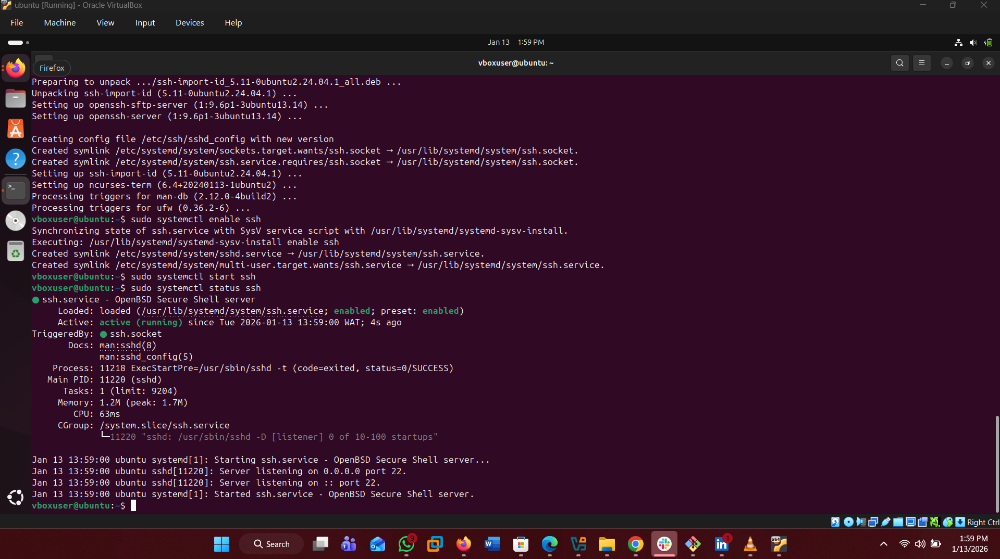
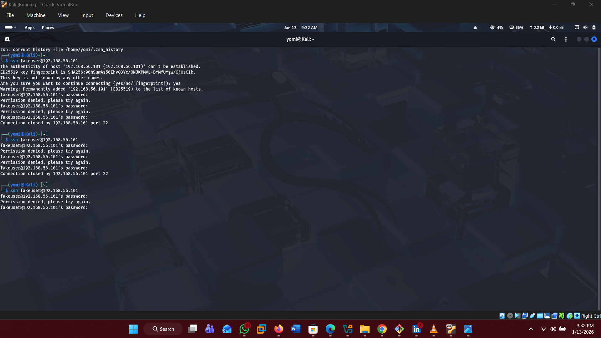
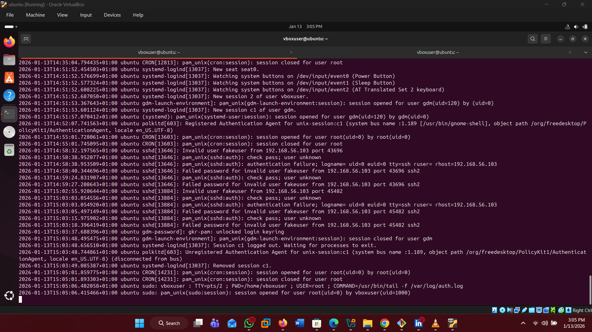

## Detection & Analysis
- Monitored Linux authentication logs via Wazuh agent
- Detected brute-force behavior through Wazuh correlation rules
- Alert mapped to MITRE ATT&CK technique T1110 (Brute Force)

📸 Screenshots:
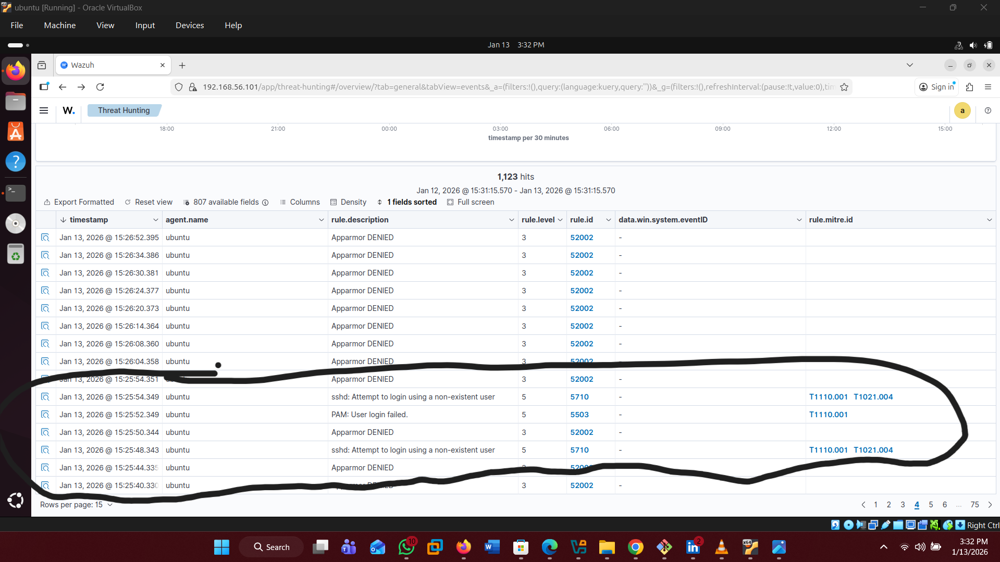
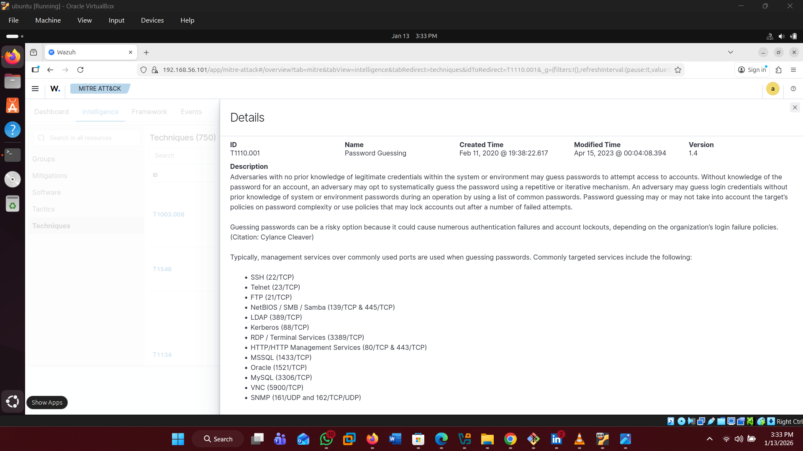

---

## 🖥️ Windows Authentication Failure (T1110)
- Simulated repeated Windows authentication failures
- Analyzed Event ID 4625
- Detected brute-force behavior in Wazuh

📸 Screenshots:
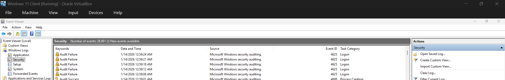
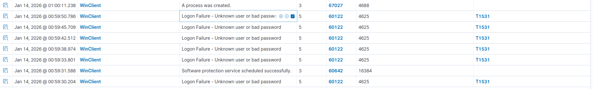
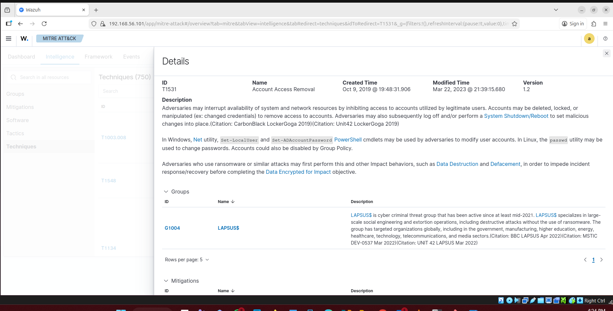

---

## 🧠 PowerShell Abuse Detection (T1059.001)
- Simulated suspicious PowerShell execution
- Detected PowerShell process creation using Sysmon
- Investigated activity in Wazuh SIEM
- MITRE ATT&CK: T1059.001

📸 Screenshot: 
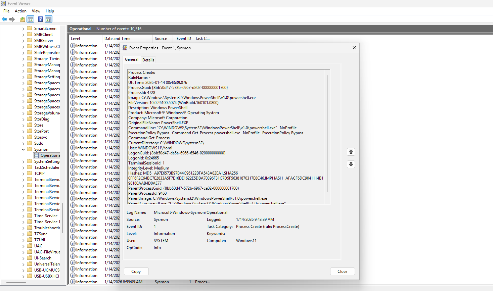
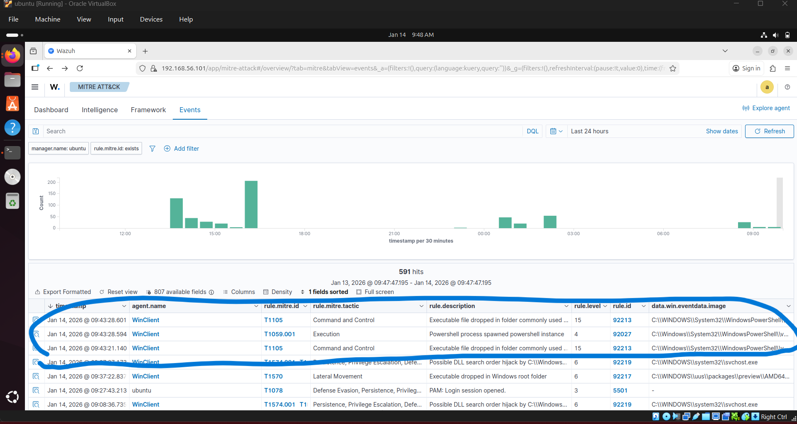

---

## 🦠 Malware Detection – EICAR Test
- Triggered antivirus detection using EICAR test file
- Analyzed Windows Defender alerts
- Verified malware alert ingestion into Wazuh
- MITRE ATT&CK: T1204

📸 Screenshot:
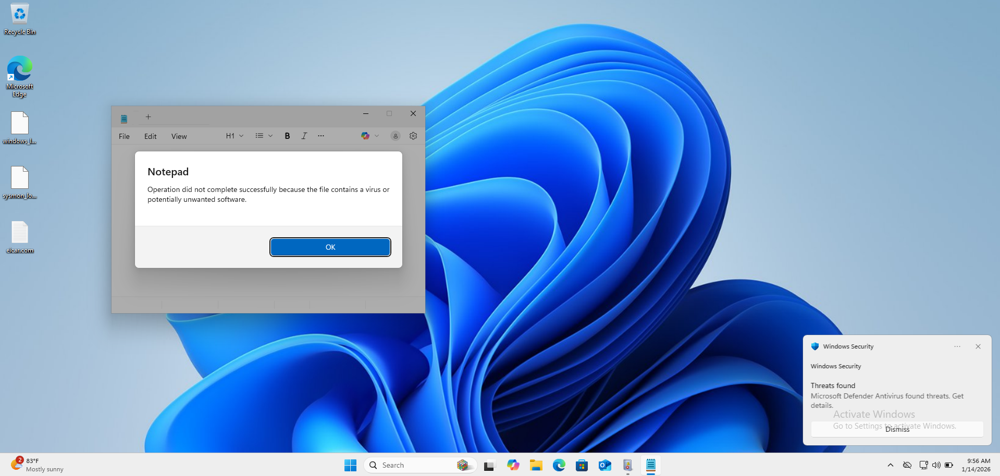
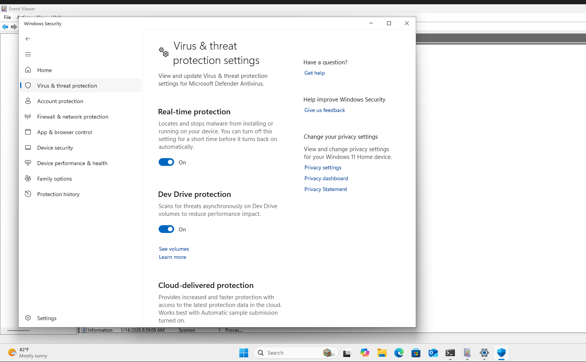
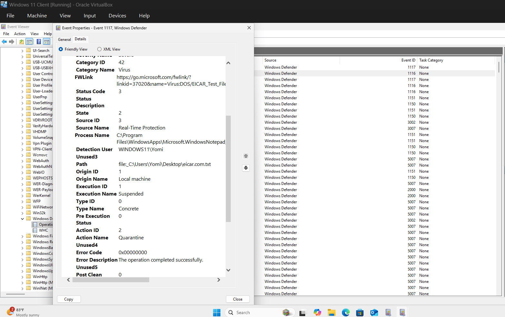
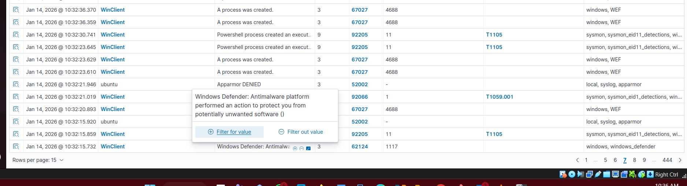

---

## Key Skills Demonstrated
- SIEM log analysis
- Threat detection & investigation
- MITRE ATT&CK mapping
- Endpoint security monitoring
- SOC analyst workflows
