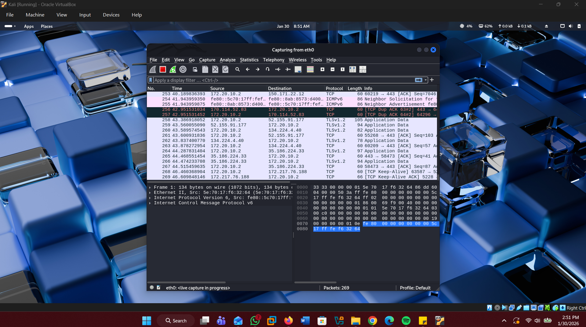
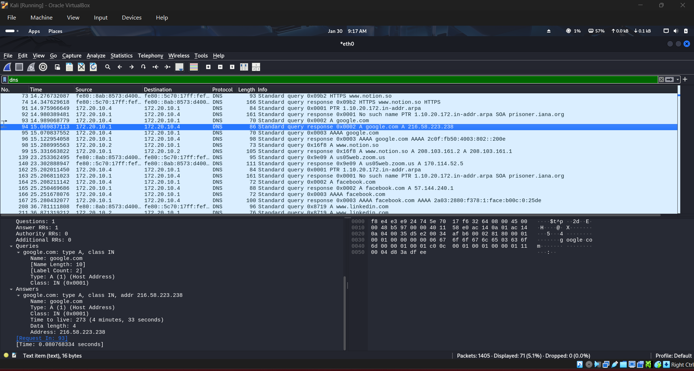
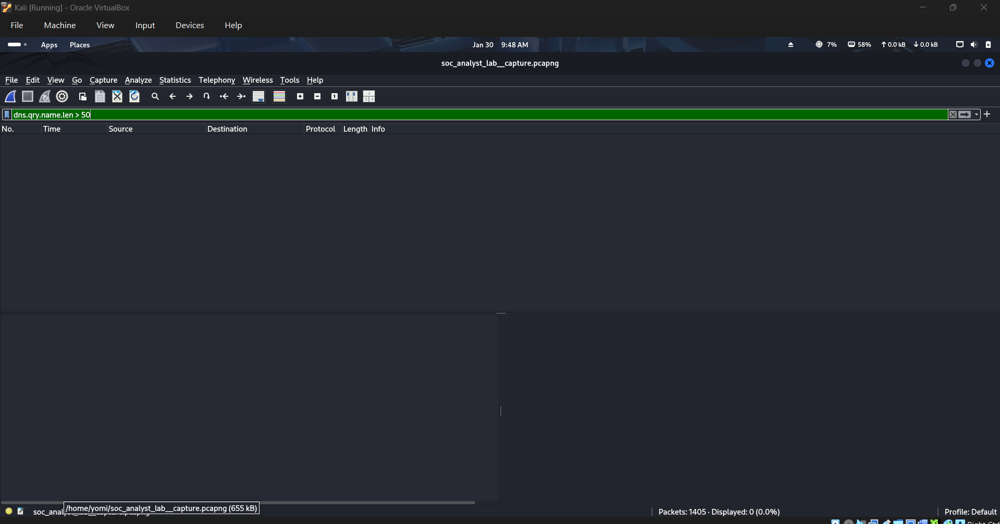
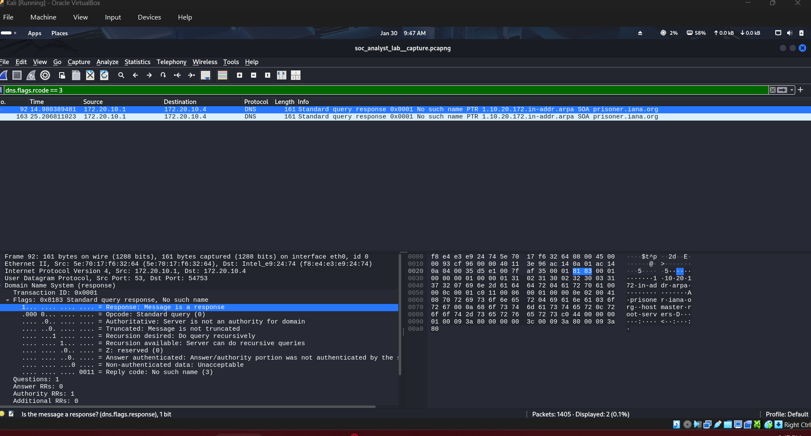
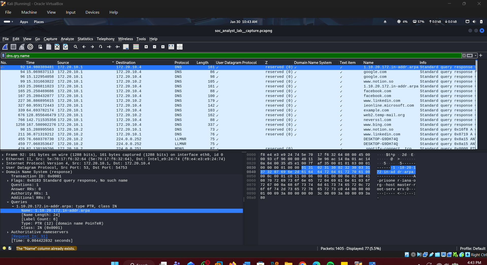
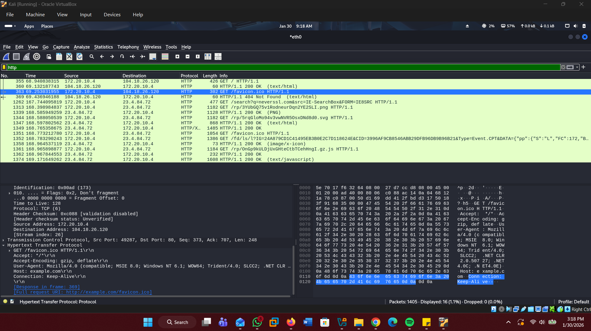
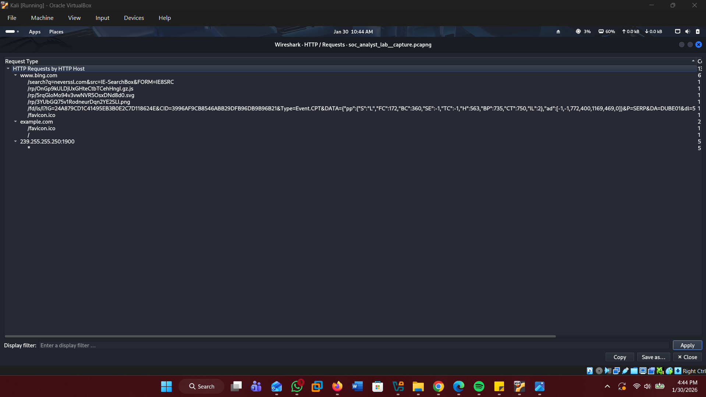
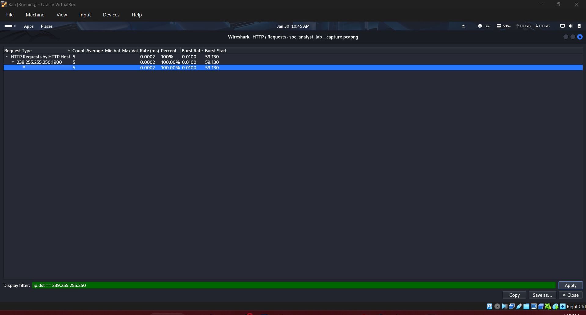
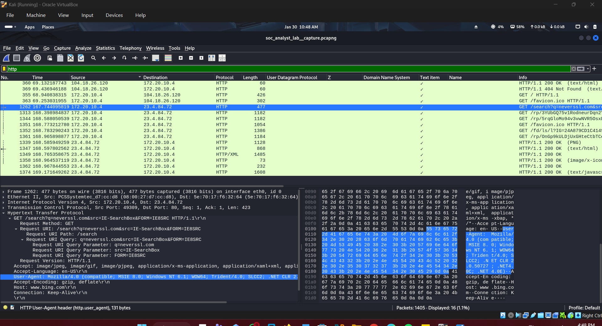
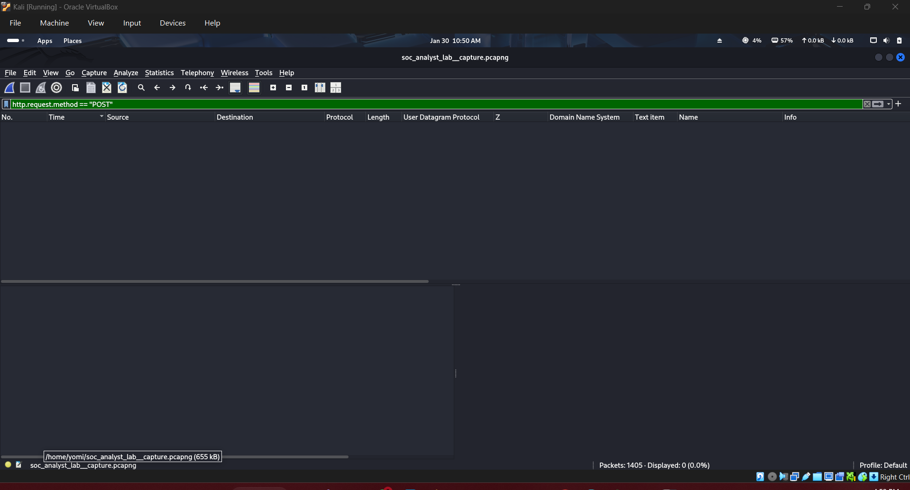

# Network Traffic Analysis - DNS & HTTP Investigation

##  Objective
Capture and analyze network traffic from a Windows VM to identify potential DNS and HTTP anomalies that could indicate malicious activity such as data exfiltration, C2 communication, or credential theft.

## Tools Used
- *Wireshark 4.x* - Network protocol analyzer
- *Oracle VirtualBox* - Running Kali Linux VM
- *Windows VM* - Traffic source (IP: 172.20.10.3)
[4:56 pm, 30/01/2026] Mine: ## 📊 Traffic Capture Summary

Initial packet capture showing [X] total packets captured during browsing session

- *Capture Duration*: [X] minutes
- *Total Packets*: [X] packets
- *Protocols*: DNS, HTTP, TCP, UDP, SSDP
- *Source IP*: 172.20.10.3 (Windows VM)
- *Gateway*: 172.20.10.1

---

## Part 1: DNS Traffic Analysis

### Objective
Identify indicators of compromise in DNS traffic:
- DNS tunneling (excessively long domains)
- Domain Generation Algorithms (random-looking domains)
- High query frequency (beaconing)
- Suspicious top-level domains

### Analysis Process

#### Step 1: Isolate DNS Traffic

Applied filter: dns - Showing only DNS packets

*Filter Used:*
[4:56 pm, 30/01/2026] Mine: *Results*: [X] DNS packets identified

#### Step 2: Statistical Overview

Statistics → DNS showing all queried domains with frequency counts

*Domains Observed*:
- [List a few examples from your capture]
- Example: www.bing.com, example.com, etc.

#### Step 3: Check for Excessively Long Domain Names (DNS Tunneling)

Filter: dns.qry.name.len > 50 - Testing for DNS tunneling attempts

*Filters Tested:*
[4:56 pm, 30/01/2026] Mine: *Finding: ✅ **No domains exceeding length thresholds*
- Result: No DNS tunneling detected
- Longest domain: [X] characters

#### Step 4: Identify Failed DNS Queries (Potential DGA)

Filter: dns.flags.rcode == 3 - Showing non-existent domain responses

*Filter Used:*
[4:56 pm, 30/01/2026] Mine: *Findings*: 
- *2 NXDOMAIN responses detected*
- *Source IP*: 172.20.10.1 (Gateway/Router)
- *Query Type*: PTR (Reverse DNS lookups)
- *Domains*: [X].in-addr.arpa format

*Analysis*: 
These are *benign* - PTR queries are reverse DNS lookups performed by the router for logging purposes. The source is the gateway, not the VM, and failed PTR lookups are common for IPs without reverse DNS records configured.

#### Step 5: Domain Name Inspection

Added dns.qry.name as column for visual inspection of all queried domains

*Manual Review*: Inspected all domain names for:
- ❌ Random character sequences
- ❌ High consonant-to-vowel ratios
- ❌ Algorithmically-generated patterns
- ❌ Suspicious TLDs (.xyz, .top, .tk, .ml, .ga)

 *Results*: ✅ All domains appear legitimate

### DNS Analysis Summary

| Check | Filter/Method | Result | Indicator |
|-------|--------------|--------|-----------|
| Long domains (>50 chars) | dns.qry.name.len > 50 | None found | ✅ Clean |
| Long domains (>100 chars) | dns.qry.name.len > 100 | None found | ✅ Clean |
| NXDOMAIN responses | dns.flags.rcode == 3 | 2 found (PTR from router) | ✅ Benign |
| Suspicious TLDs | Manual review | None detected | ✅ Clean |
| DGA patterns | Visual inspection | No random strings | ✅ Clean |
| Query frequency | Statistics view | Normal distribution | ✅ Clean |

*Conclusion*: No malicious DNS activity detected. All DNS queries appear to be legitimate browsing traffic.

---

## 🌐 Part 2: HTTP Traffic Analysis

### Objective
Identify security issues in HTTP traffic:
- Connections to IP addresses (bypassing DNS)
- Suspicious User-Agent strings (malware indicators)
- Repeated outbound requests (C2 beaconing)
- Cleartext credentials in POST data

### Analysis Process

#### Step 1: Isolate HTTP Traffic

Applied filter: http - Displaying only HTTP protocol packets

*Filter Used:*

#### Step 2: Analyze HTTP Requests by Host

Statistics → HTTP → Requests - Overview of all HTTP destinations

*Key Finding: 🚨 **HTTP Request to IP Address Detected*

*Hosts Contacted*:
1. *www.bing.com* - [X] requests
2. *example.com* - [X] requests  
3. *239.255.255.250:1900* - ⚠️ *Direct IP address connection*

#### Step 3: Investigate IP Address Connection

Detailed view of HTTP traffic to 239.255.255.250 - SSDP multicast traffic

*Filter Used:*
[4:56 pm, 30/01/2026] Mine: *Analysis of 239.255.255.250:1900*:
- *IP Type*: Multicast address (239.x.x.x range)
- *Port*: 1900 (SSDP - Simple Service Discovery Protocol)
- *Protocol*: UPnP (Universal Plug and Play)
- *Purpose*: Windows device discovery for network devices (printers, media servers, smart devices)
- *Method*: M-SEARCH (discovery request)

*Assessment: ✅ **BENIGN* - This is standard Windows networking behavior, not malicious C2 communication.

#### Step 4: User-Agent Analysis

Examining User-Agent header from HTTP request packet details

*User-Agent Observed*:
[4:56 pm, 30/01/2026] Mine: *Analysis*:
- Matches legitimate browser: [Browser name and version]
- No suspicious indicators (e.g., python-requests, curl, outdated IE)
- Consistent with Windows VM environment

*Result*: ✅ Normal browser identification

#### Step 5: Review HTTP Request Details

HTTP traffic with host, method, and URI columns for comprehensive view

*Columns Added*:
- http.host - Destination hostname
- http.request.method - HTTP method (GET/POST)
- http.request.uri - Requested path

*Observed Requests to www.bing.com*:
[4:57 pm, 30/01/2026] Mine: *Analysis*: All requests are legitimate web resources (search, JavaScript, images, analytics, favicon)

#### Step 6: Check for POST Requests (Credential Exposure)

Filter: http.request.method == "POST" - Checking for form submissions

*Filter Used:*
[4:57 pm, 30/01/2026] Mine: *Results*: [Displayed: 0 or number found]

*If POST requests found*: 
- Click packet → Right-click → Follow → HTTP Stream
- Inspect form data for credentials
- Look for: username=, password=, login=, api_key=

*Result*: [No POST requests / POST requests contained no credentials]

### HTTP Analysis Summary

| Check | Filter/Method | Finding | Assessment |
|-------|---------------|---------|------------|
| IP address connections | Statistics → HTTP → Requests | 239.255.255.250:1900 | ✅ SSDP (benign) |
| Suspicious domains | Manual review | www.bing.com, example.com | ✅ Legitimate |
| User-Agent | Packet inspection | [Browser version] | ✅ Normal |
| POST requests | http.request.method == "POST" | [None/No credentials] | ✅ Safe |
| Request frequency | Statistics vi…
[4:57 pm, 30/01/2026] Mine: # Show all HTTP traffic
http

# Only HTTP requests
http.request

# Only HTTP responses
http.response

# Specific methods
http.request.method == "GET"
http.request.method == "POST"
http.request.method == "PUT"

# Specific host
http.host == "www.example.com"

# Show User-Agent
http.user_agent

# Authentication headers
http.authorization
http contains "Authorization: Basic"

# Specific status codes
http.response.code == 200
http.response.code == 404
http.response.code == 500

# URLs containing keywords
http.request.uri contains "password"
http.request.uri contains "login"

# Connections to IP addresses
http.request && !http.host matches "[a-zA-Z]"
[4:57 pm, 30/01/2026] Mine: # DNS and HTTP from your VM
(dns || http) && ip.src == 172.20.10.3

# Failed DNS or HTTP errors
dns.flags.rcode == 3 || http.response.code >= 400

# POST requests with large payloads
http.request.method == "POST" && http.content_length > 1000
