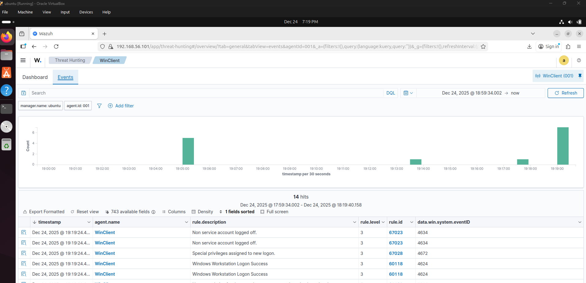
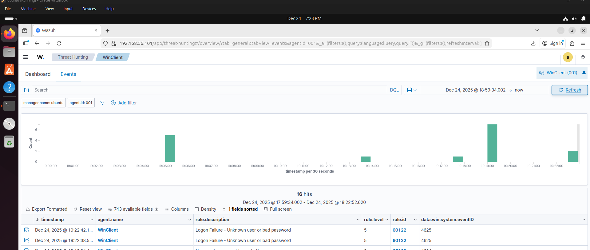
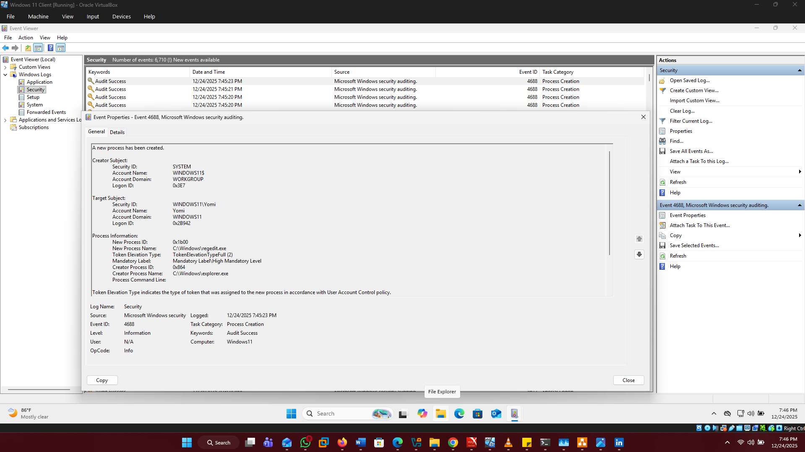

# Windows Event Logging & Telementary Integration

This lab demonstrates *Windows event monitoring* and integration with *Wazuh SIEM*. It includes screenshots of Event Viewer logs, event details, and Wazuh dashboard visibility for key Windows security events.

---

## Lab Overview

The purpose of this lab is to simulate common Windows security events and show how SOC analysts monitor them using both *native Windows tools* and *Wazuh SIEM*.

*Events Covered:*
1. *Event ID 4624* – Successful Logon
2. *Event ID 4625* – Failed Logon
3. *Event ID 4688* – Process Creation

Screenshots show logs in both *Windows Event Viewer* and *Wazuh Dashboard*.

---

## Event ID 4624 – Successful Logon

This event is generated when a user successfully logs on.

*Key Fields Reviewed:*
- *TimeCreated* – Timestamp of logon
- *User* – User account that logged in
- *Source* – Machine or service generating the event
- *Logon Type* – Interactive, Remote, etc.

*Screenshots:*

  

---

## Event ID 4625 – Failed Logon

This event is generated when a logon attempt fails.

*Key Fields Reviewed:*
- *TimeCreated* – Timestamp of failed logon
- *User* – Account that failed to log in
- *Failure Reason* – Why the logon failed
- *Source* – Machine or service generating the event

*Screenshots:*

  

---

## Event ID 4688 – Process Creation

This event is generated when a new process is created.

*Key Fields Reviewed:*
- *New Process Name* – The executable that was launched
- *Parent Process* – Process that spawned this process
- *Command Line* – Full command used (if enabled)
- *User Context* – User that executed the process

*Screenshots:*

  

---

## Lab Notes / Observations

- Event Viewer logs provide detailed information about user activity and system events.  
- Wazuh SIEM collects these logs centrally, allowing correlation and alerting for security events.  
- SOC analysts use this information to *detect suspicious activity*, such as multiple failed logons, unusual process creation, or unauthorized access attempts.  

---

## Folder Structure
